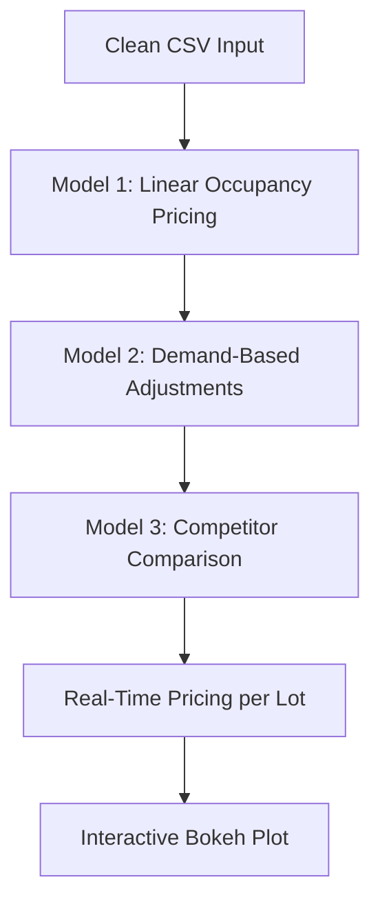

# 🚗 Dynamic Pricing for Urban Parking Lots

This project implements a 3-stage real-time dynamic pricing model for urban parking spaces using live occupancy, traffic, queue length, special day status, and nearby lot competition. It simulates a pricing engine that adapts to demand and conditions in real-time and visualizes it using Bokeh.

---

## 🧠 Problem Statement
Urban parking spaces face overcrowding and inefficient static pricing. This project builds a demand-sensitive, data-driven pricing strategy to optimize occupancy and distribute traffic.

> **Data Source**: Simulated dataset (14 parking lots × 73 days × 18 time points/day)

---

## ⚙️ Tech Stack

- **Python** 3.x  
- **Pandas** – for data manipulation  
- **NumPy** – for numerical computations  
- **Bokeh** – for interactive time series plotting  
- **GeoPy** – to calculate distances between parking lots

---

## 📁 Dataset (cleaned)

**File:** `cleaned_dataset_v2.csv`

| Column         | Description                                      |
|----------------|--------------------------------------------------|
| ParkingLotID   | Unique lot ID (from `SystemCodeNumber`)         |
| Time           | Timestamp (combined `LastUpdatedDate` + `Time`) |
| Occupancy      | Number of vehicles present                       |
| Capacity       | Max capacity of lot                              |
| QueueLength    | Vehicles waiting to enter                        |
| Traffic        | Encoded (1: Low, 5: Medium, 10: High)            |
| SpecialDay     | Boolean flag for special events                  |
| VehicleType    | Type of vehicle (car, bike, truck, etc.)         |
| Latitude/Longitude | Lot location coordinates                    |

---

## 🧩 Architecture Flow


## 🧮 Pricing Models
1️⃣ Linear Pricing Model
```mermaid
P_{t+1} = P_t + α * (Occupancy / Capacity)
```
2️⃣ Demand-Based Model
```mermaid
Demand = 1.5 * Occ + 1.0 * Queue - 0.5 * Traffic + 0.75 * Special + 0.3 * VehicleTypeWeight
Price = BasePrice * (1 + λ * NormalizedDemand)
```
3️⃣ Competitive Pricing Model
Adjusts price based on average price of nearby lots (< 500m) and occupancy.

📊 Visualization Example

🚀 How to Run
Install dependencies:
```mermaid
pip install pandas numpy bokeh geopy openpyxl
```
Open dynamic_pricing_simulation.ipynb

Load cleaned_dataset_v2.csv

Set the lot focus (e.g. "BHMBCCMKT01")

Run all cells and visualize pricing trends

✅ Output
Dynamic, responsive pricing for urban lots

Real-time adjustment to demand factors

Interactive Bokeh time-series graph
